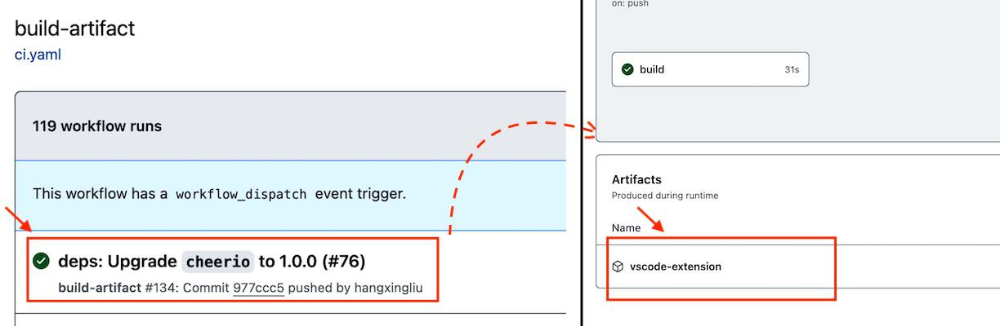

# Systemd Configurations Helper for Visual Studio Code

[](https://github.com/hangxingliu/vscode-systemd/actions/workflows/ci.yaml)

A Visual Studio Code extension to help you read and write *Systemd unit config*, *mkosi config* and *Podman Quadlet unit files*.


## Features

- Syntax highlighting, auto-completion, folding range and linter for the following files
  - Various systemd unit files (configuration files)
  - [mkosi](https://github.com/systemd/mkosi) configuration files
  - [Podman Quadlet](https://github.com/containers/podman) unit files
- Document and help information for directives and specifiers in the editor

## Installation

1. Click `Extension` button in left side of VSCode. (Shortcut: <kbd>Ctrl</kbd>+<kbd>Shift</kbd>+<kbd>X</kbd> or <kbd>Command</kbd>+<kbd>Shift</kbd>+<kbd>X</kbd>)
2. Search for `hangxingliu.vscode-systemd-support` and click the `Install` button.

### via Command Line

You can replace the `code` command to `codium` in following scripts if you are using [VSCodium](https://vscodium.com/)

``` bash
code --install-extension hangxingliu.vscode-systemd-support
# Or install from a downloaded VSIX file:
code --install-extension vscode-systemd-support-${version}.vsix
```

### Nightly Builds

Nightly builds can be found and downloaded in Github Actions page 
(Click any successful workflow run and the extension file is located in the **Artifacts** pane):
<https://github.com/hangxingliu/vscode-systemd/actions/workflows/ci.yaml>



## Changelog

### 2.2.0 (2024-03-16)

- Add auto-completion and signature hint support for boolean values for directives
- Add support for a new unit file `iocost.conf`
- Add more completion/documentation for directive value
- Add more documentation for deprecated/renamed/removed directives
- Add version information into the documentation to indicate the first supported version and the version at which the directive became deprecated/removed
- Add a new configuration named `systemd.podman.completion` to enable/disable providing completion items related to Podman Quadlet by default
- Add a new configuration named `systemd.version` to ensure the extension only offers compatible auto-completion and provides more precise linting feature
- Add a new configuration named `systemd.style.boolean` to specify the preferred boolean value format for auto-completion
- Fixed a bug where the documentation for some directives was not displayed
- Fixed some errors in the documentation, including incorrect markup tags, tables that are not 
displaying properly and unexpected email addresses
- Fixed auto-completion feature for directives in the following sections: `MACVTAP`/`IPVTAP`/`Tap`
- Renamed the following configurations: (The old names will still be supported in 2024)
    - `systemd.lintDirectiveKeys` => `systemd.directive-keys.lint`
    - `systemd.customDirectiveKeys` => `systemd.directive-keys.custom`
- Fixed the parser to correctly detect unit types `sysupdated` and `repartd`
- Updated unit name completion for full special system units 
- Updated diagnostics to display detailed deprecation information and providing quick fixes for automatically renaming deprecated directives.
- Updated documentation to the latest
- Improved the process of changing unit file types
    - Highlighting recommended types in the type picker for easier selection
    - Retaining manually changed types in the workspace state to ensure they are remembered upon reopening the editor
- The unit file type of Podman Quadlet has been divided into several more specific types, such as `container`, `image`, ...

See [CHANGELOG.md](docs/CHANGELOG.md)

## Build & Contributing

Please check out the document [CONTRIBUTING.md](docs/CONTRIBUTING.md) for information 
about building/contributing this project

## License

[MIT](LICENSE)

## References

- [Systemd](https://github.com/systemd/systemd)
- [Podman](https://github.com/containers/podman)
- [mkosi](https://github.com/systemd/mkosi)
- [TextMate Language Grammars](https://macromates.com/manual/en/language_grammars)
- [Systemd Syntax](https://www.freedesktop.org/software/systemd/man/systemd.syntax.html#)
- [Icon resources](https://github.com/edent/SuperTinyIcons)
- [bearmini's systemd extension](https://github.com/bearmini/vscode-systemd-unit-file)
    - I created this extension to improve bearmini's systemd extension. It only provides syntax highlights.

